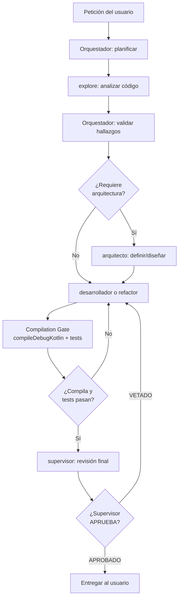

# Pipeline Workflow

Este skill activa el pipeline completo de agentes encadenados para cambios de
código que requieran análisis, implementación, revisión y entrega.

## Cuándo usarlo

- Cambios que afecten 2+ archivos
- Refactors, optimizaciones o fixes de bugs
- Implementación de nuevas features
- Cualquier cambio donde haya riesgo de romper algo

## No usar cuando

- Solo lectura de código
- Consultas informativas
- Cambios triviales de 1 archivo (typo, string)

## Pipeline completo



## Reglas de ejecución

### 1. Auto-avance
Cada paso exitoso → siguiente paso inmediato. No esperar confirmación.

### 2. Heartbeat
Cada 30s durante operaciones largas:
```
⏳ [paso actual] — (N segundos)
```

### 3. Pre-flight checks
Antes de editar: grep del símbolo en todos los archivos, verificar callers y tests.

### 4. Supervisor gate
`supervisor` debe aprobar antes de entregar. Si veta, repetir el ciclo.

### 5. Formato estructurado entre agentes
Los agentes se pasan datos en formato JSON con campos:
```json
{
  "files": ["ruta/archivo.kt"],
  "changes": [
    {
      "file": "ruta/archivo.kt",
      "line": 42,
      "type": "fix|refactor|optimize",
      "description": "Qué cambió y por qué",
      "oldCode": "...",
      "newCode": "..."
    }
  ],
  "status": "pending|done|failed",
  "compilation": "pass|fail"
}
```

## Ejemplo de flujo

```
Usuario: "Optimiza el código, hay fugas de memoria"

1. Orquestador planifica → [explore, refactor, supervisor]
2. explore encuentra InputStream leak en ImageJavaScriptInterface.kt
3. explore devuelve JSON con el hallazgo
4. refactor aplica el fix (use { })
5. refactor ejecuta compileDebugKotlin ✅
6. supervisor revisa el cambio
7. supervisor APRUEBA
8. Orquestador entrega al usuario
```
